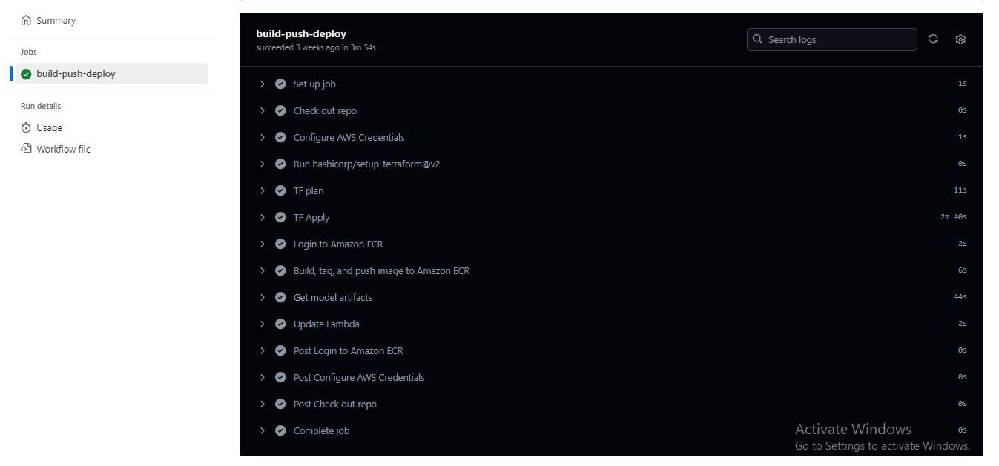

# Medical Insurance Price Prediction - MLOps

## 📄 Description
Medical Insurance Price Prediction aims to estimate the cost of insurance premiums based on factors like age, gender, BMI, smoking habits, and region. By analyzing historical data using machine learning models, this project helps uncover patterns affecting insurance costs. The insights can support fair pricing strategies and guide individuals on how lifestyle and demographics influence premiums.

## 🚀⚙️ Development 

- Developed the ML models (LR, RFR, SVR) to predict medical insurance pricing, achieving an R² score of 0.847. Engineered ML training pipeline using Mage.ai, integrated experiment tracking with MLflow, and securely stored trained models on S3 Bucket. 
- Dockerized the model for efficient deployment via Lambda Function, utilizing Kinesis as an event trigger for real-time predictions.
- Followed best practices, including unit testing, code formatting, and pre-commit hooks to enforce code quality. 
- Established CI/CD pipelines with GitHub Actions for automated testing and deployment. Implemented comprehensive model monitoring using Evidently, tracking data drift, concept drift, and data quality to ensure robust performance in production.

## Mage - Model Training Pipelines

### Preprocessing Pipeline

    

### Trainig Pipeline

    

### MLFlow Experiment Tracking

    

## CI/CD Pipelines

### CI Pipeline

    

### CD Pipeline

    

## Monitoring 
Monitored the model's performance using Evidently within a Jupyter Notebook, analyzing local test data.

### Evidently Dashboard

    

### Evidently Report

    

### Evidently TestSuite

    

